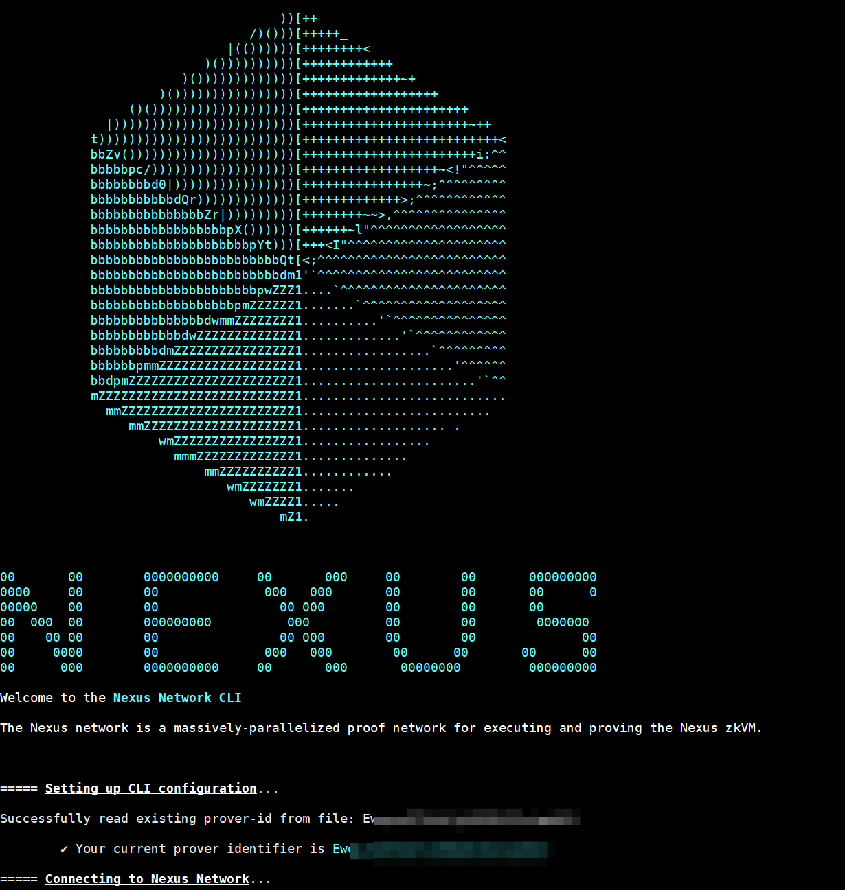

# nexus docker image
docker image for nexus cli

# usage
```
docker run -it -d --name nexus -e PROVERID="YOUR_PROVERID" csrocks/nexus:pid
```

# check logs
```
docker logs nexus -f --tail 100
```

[](nexus-docker-logs.png)
